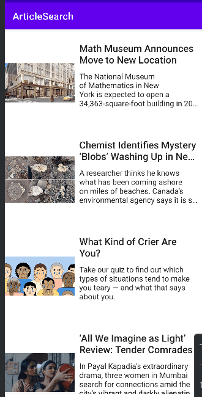

# Lab 6: ArticleSearch Pt 3

Course Link: [CodePath Android Course](https://courses.codepath.org/courses/and102/unit/6)

Submitted by: **Yonghyeon Shin** <!-- Replace 'Your Name Here' with your actual name -->

**NYT ArticleSearch Pt 3** is an app that combines the Best Setting Books app and the Article Search app, allowing users to navigate between books and articles seamlessly.

Time spent: **4** hours spent in total <!-- Replace 'X' with the number of hours you spent on this project -->

## Application Features

### Required Features

The following **required** functionality is completed:

- [x] (3 pts) **Add and implement Bottom Navigation to your application**
  - Allows navigation between books and articles using Bottom Navigation.
  - ![GIF showing Bottom Navigation functionality]

- [x] (4 pts) **Dynamically use fragments within Activities**
  - Displays books and articles in their respective fragments, dynamically managed within the main activity.
  - ![GIF showing fragment management]

- [x] (3 pts) **Customize the toolbar and icons**
  - Provides a unique toolbar experience for each section with relevant icons.
  - ![GIF showing toolbar customization]

### Stretch Features

The following **stretch** functionality is implemented:

- [x] (+2 pts) **Customize a Home screen using the [Most Popular NYTimes Articles API](https://developer.nytimes.com/docs/most-popular-product/1/overview)**
  - Displays a list of popular articles on a custom home screen.
  - ![GIF showing Home screen with popular articles] <!-- Replace this link with your actual image/GIF link -->

- [x] (2 pts) **Respond to device orientation changes without resetting the application**
  - Ensures app content maintains its state across orientation changes.
  - ![GIF showing orientation change handling]

## Video Walkthrough

Here's a walkthrough of implemented user stories:




## Notes

Describe any challenges encountered while building the app. <!-- Replace this with your specific challenges and experiences -->

## Resources

- [Getting Started with Navigation](https://developer.android.com/guide/navigation/navigation-getting-started)
- [Navigation UI with Bottom Navigation](https://developer.android.com/guide/navigation/navigation-ui)
- [Fragments](https://developer.android.com/guide/fragments)
- [Programmatic Navigation](https://developer.android.com/guide/navigation/navigation-programmatic)
- [AndroidX Navigation Library](https://developer.android.com/jetpack/androidx/releases/navigation)

## License

```plaintext
    Copyright [2024] [Yonghyeon Shin]

    Licensed under the Apache License, Version 2.0 (the "License");
    you may not use this file except in compliance with the License.
    You may obtain a copy of the License at

        http://www.apache.org/licenses/LICENSE-2.0

    Unless required by applicable law or agreed to in writing, software
    distributed under the License is distributed on an "AS IS" BASIS,
    WITHOUT WARRANTIES OR CONDITIONS OF ANY KIND, either express or implied.
    See the License for the specific language governing permissions and
    limitations under the License.
